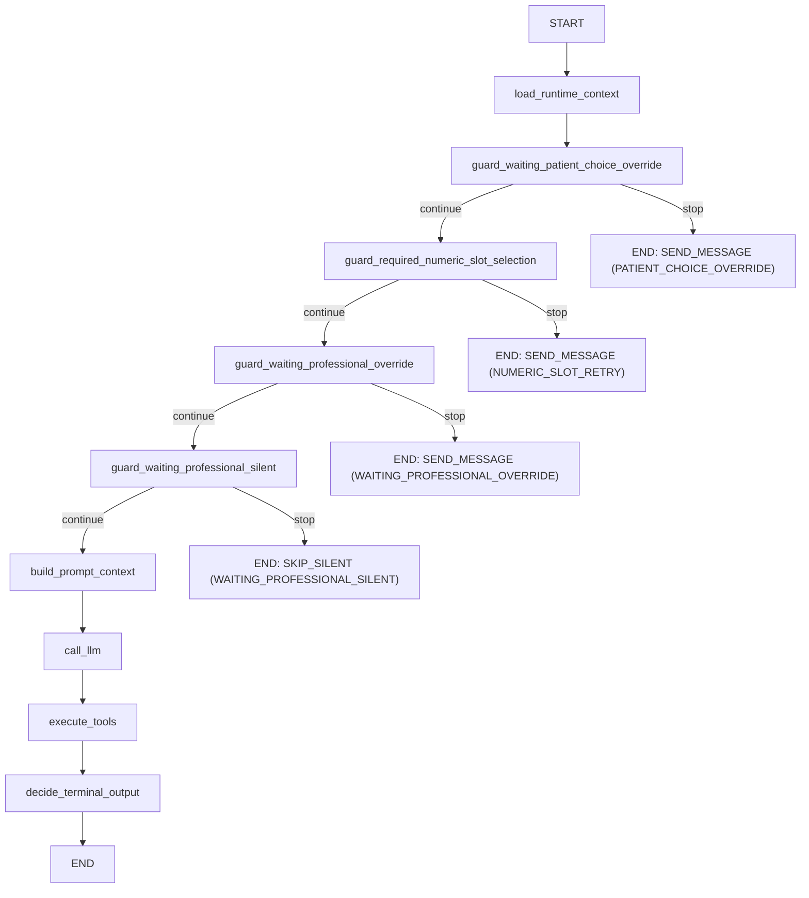
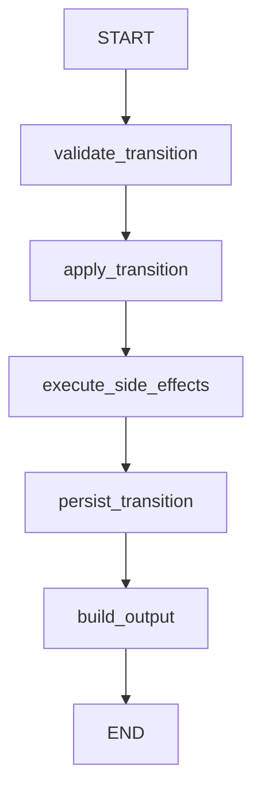

# Backend Context (MVP)

## Estado actual
- Backend MVP multi-tenant para atención por WhatsApp.
- Stack: FastAPI + arquitectura hexagonal + persistencia en Firestore.
- Orquestación agéntica: LangGraph en `src/services/agentic`.
- Providers activos:
  - WhatsApp: Meta Cloud API.
  - LLM: Gemini en Vertex AI (`GEMINI_*`).

## Reglas de Ingeniería Backend (Obligatorias)
1. No usar `hasattr()` / `getattr()` ni reflexión similar.
2. Importar módulos, no objetos directamente.
3. Respetar arquitectura hexagonal y límites limpios.
4. No usar `global`.
5. Usar sintaxis de unión con `|` (`str | None`), no `Optional[str]`.
6. Mantener imports al inicio del archivo.
7. Usar Pydantic para modelos de datos.
8. Capturar excepciones específicas (evitar `Exception` genérica salvo necesidad estricta para no cortar flujo principal).
9. Seguir el Zen de Python.

## Estructura de capas
- `src/entrypoints/web`: capa HTTP (routers, handlers, dependencias auth).
- `src/services`: casos de uso y DTOs principales.
- `src/services/agentic`: grafos y engine de orquestación (`ConversationGraph`, `SchedulingTransitionGraph`).
- `src/ports`: contratos/interfaces para adapters.
- `src/adapters/outbound`: implementaciones concretas (Meta, Gemini, seguridad, Firestore, in-memory para tests).
- `src/domain`: entidades/agregados Pydantic.
- `src/infra`: settings + wiring en `container.py`.

## Reglas de dependencia
- Flujo permitido: `entrypoints -> services -> ports <- adapters`.
- `infra/container` conecta puertos con adapters.
- `services` y `domain` no deben depender de adapters concretos.

## Funcionalidad implementada
- Auth:
  - `POST /v1/auth/register` deshabilitado (`404`)
  - `POST /v1/auth/login`
  - `POST /v1/auth/refresh`
  - `POST /v1/auth/logout`
- User admin local (sin endpoint HTTP):
  - `make user-bootstrap-master`
  - `make user-create`
  - `make user-delete`
- Prompt del agente:
  - `GET /v1/agent/system-prompt`
  - `PUT /v1/agent/system-prompt`
- Onboarding WhatsApp:
  - `POST /v1/whatsapp/embedded-signup/session`
  - `POST /v1/whatsapp/embedded-signup/complete`
  - `GET /oauth/meta/callback`
  - `GET /v1/whatsapp/connection`
- Webhook:
  - `GET /v1/webhooks/whatsapp` (verify token)
  - `POST /v1/webhooks/whatsapp` (procesamiento inbound)
- Conversaciones:
  - `GET /v1/conversations`
  - `GET /v1/conversations/{conversation_id}/messages`
  - `PUT /v1/conversations/{conversation_id}/control-mode`
- Blacklist por tenant:
  - `GET /v1/blacklist`
  - `POST /v1/blacklist`
  - `DELETE /v1/blacklist/{whatsapp_user_id}`
- Dev:
  - `POST /v1/dev/memory/reset`
  - `GET /healthz`

## Lógica clave en webhook
- Resuelve tenant por `phone_number_id`.
- Deduplica por `provider_event_id`.
- Si contacto está en blacklist: ignora conversación/mensajes/IA y marca procesado.
- Si evento es de dueño (`OWNER_APP`, coexistence echo):
  - guarda mensaje `role=human_agent`,
  - fuerza conversación a `HUMAN`.
- Si evento es cliente (`CUSTOMER`):
  - guarda inbound,
  - si conversación está en `HUMAN`, no responde IA,
  - si está en `AI`, genera respuesta con Gemini y envía por WhatsApp.

## Persistencia actual
- Firestore como almacenamiento principal de estado de dominio.
- El estado del grafo se ejecuta en memoria por invocación; no reemplaza entidades de dominio.
- Refresh tokens persistidos y revocados en Firestore (rotación estricta).
- Endpoints dev (`/v1/dev/memory/reset` y `/v1/dev/memory/chat/reset`) limpian estado en Firestore.

## Flujo LangGraph (detallado)
- Cada mensaje inbound dispara una ejecución nueva del grafo desde `START`.
- En esta iteración no hay `checkpointer` ni `thread_id`; no se reanuda en nodo intermedio.
- La continuidad del proceso depende de estado persistido en Firestore (por ejemplo, `SchedulingRequest.status`, `Conversation.control_mode`).

### ConversationGraph (webhook AI path)

Nodos: 9 (`load_runtime_context`, `guard_waiting_patient_choice_override`, `guard_required_numeric_slot_selection`, `guard_waiting_professional_override`, `guard_waiting_professional_silent`, `build_prompt_context`, `call_llm`, `execute_tools`, `decide_terminal_output`).

### SchedulingTransitionGraph (transiciones de agenda)

Nodos: 5 (`validate_transition`, `apply_transition`, `execute_side_effects`, `persist_transition`, `build_output`).

## Logging y errores
- Logging estructurado JSON en `stdout`.
- Correlación por `X-Request-ID`:
  - si llega desde cliente/proxy, se reutiliza;
  - si no llega, se genera en middleware.
- Todas las respuestas HTTP incluyen header `X-Request-ID`.
- Errores no controlados en entrypoints:
  - response `500` con body `{"detail":"internal server error","request_id":"..."}`,
  - traceback completo solo en logs del servidor.
- Config por env:
  - `LOG_LEVEL` (default `INFO`)
  - `LOG_INCLUDE_REQUEST_SUMMARY` (default `false`)

## Comandos útiles
- Setup:
  - `uv sync --group dev`
  - `uv run pre-commit install`
- Run API:
  - `uv run uvicorn src.entrypoints.web.main:app --reload`
- Checks:
  - `make static-checks`
  - `uv run pytest tests/services -q`
- Flujo OAuth local:
  - `make user-bootstrap-master` (solo primera vez)
  - `make oauth-flow`
  - `make memory-reset`
  - `make chat-memory-reset`
