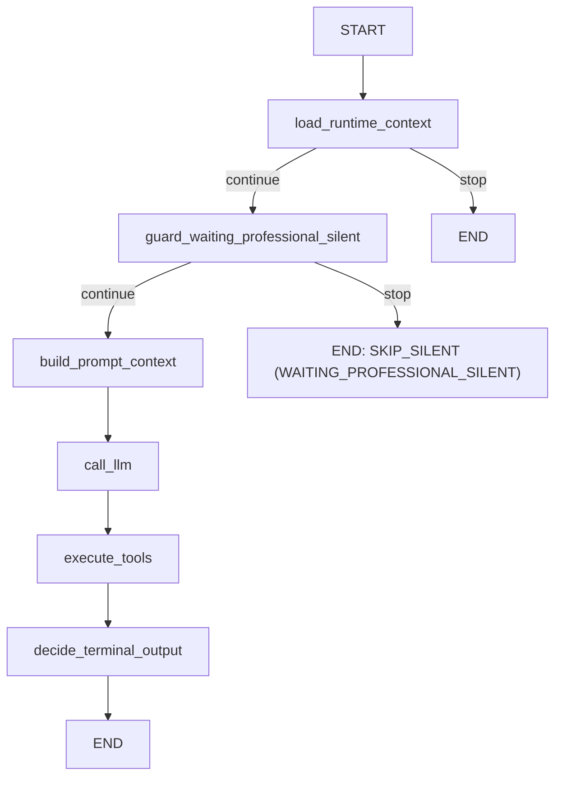
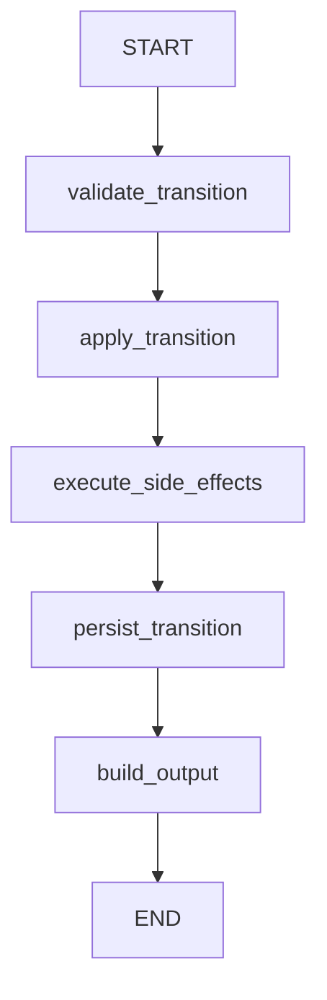

# Backend Context

## Estado actual
- Backend multi-tenant para atención y agendamiento por WhatsApp.
- Stack: FastAPI + arquitectura hexagonal + persistencia en Firestore.
- Orquestación agéntica: LangGraph en `src/services/agentic`.
- Providers activos:
  - WhatsApp: Meta Cloud API.
  - LLM: Gemini en Vertex AI (`GEMINI_*`).
  - Calendario: Google Calendar (OAuth por tenant).
  - Tareas diferidas: Cloud Tasks (auto-cierre de sesiones y recordatorios).
  - Email transaccional: Resend (invitaciones y reset de contraseña).
  - Tracing: LangSmith (opcional, `langsmith_tracing_enabled`).

## Reglas de Ingeniería Backend
Ver sección "Reglas de Ingeniería Backend" en `CLAUDE.md` (fuente canónica).

## Estructura de capas
- `src/entrypoints/web`: capa HTTP.
  - `main.py`: `create_app()` — arma container, logging, CORS, middleware, rate limiter y registra routers.
  - `lifespan.py`: lifespan de FastAPI; en shutdown cierra el cliente de Firestore (drena conexiones al recibir SIGTERM de Cloud Run).
  - `routers/`: 24 routers (ver `docs/API_ENDPOINTS.md` para el mapa completo).
  - `middleware/request_context_middleware.py`: correlación `X-Request-ID`.
  - `rate_limiter.py`: `slowapi`, activable por settings.
  - `dependencies.py`: `get_container`, `get_current_claims`, `require_admin_claims`, `require_dev_endpoints`.
- `src/entrypoints/local/user_admin_cli.py`: CLI de administración de profesionales (usada por los targets de Make).
- `src/services`: casos de uso y DTOs.
- `src/services/agentic`: orquestación agéntica (ver detalle abajo).
- `src/ports`: contratos/interfaces para adapters.
- `src/adapters/outbound`: implementaciones concretas.
- `src/domain`: entidades/agregados Pydantic.
- `src/infra`: settings + wiring en `container.py`.

## Reglas de dependencia
- Flujo permitido: `entrypoints -> services -> ports <- adapters`.
- `infra/container` conecta puertos con adapters.
- `services` y `domain` no dependen de adapters concretos.

## Módulo agéntico (`src/services/agentic/`)

- `graphs/`: grafos LangGraph (`ConversationGraph`, `SchedulingTransitionGraph`) — routing y tracing, sin lógica de negocio.
- `tool_handlers/`: registry pattern — `ToolHandler` ABC + un handler por tool + `ToolHandlerRegistry` dispatcher.
  11 handlers wired en `container.py`. `patient_profile_resolver.py` resuelve los datos de perfil que
  necesita `confirm_slot_handler` (y valida el formato del email antes de crear el paciente).
- `guards/`: `ConversationGuard` ABC + `WaitingProfessionalSilentGuard` (**el único activo hoy**) + helpers.
  Los archivos `waiting_patient_choice_guard.py`, `numeric_slot_selection_guard.py` y
  `waiting_professional_override_guard.py` siguen en el repo pero **no están wired ni referenciados**:
  su lógica la absorbieron las tools `select_proposed_slot` / `reject_proposed_slots` y el orquestador.
- `prompts/`: `PromptSection` ABC + 5 secciones + `PromptAssembler` + el renderer que convierte el
  `AgentProfile` en el XML del system prompt (ver `docs/PROMPTS_CONTEXT.md`).
- `tool_calling_orchestrator.py`: loop LLM → tools → LLM (framework-agnostic, puro Python).
- `runtime_context_resolver.py`: resuelve el estado agéntico (scheduling request activa → `RuntimePromptContext`)
  y expone `enabled_tools_for_state()` a nivel de módulo para que el prompt lab y los harnesses de test
  construyan el mismo toolset que el runtime.
- `conversation_message_sender.py`: envío por WhatsApp + persistencia + archivado de subsessions.
- `workflow_runtime_adapter.py`: implementa `ConversationWorkflowRuntimePort`, delega en los componentes anteriores.
- `prompt_builder.py`: `RuntimePromptBuilder` — orquesta el build completo del prompt.
- `tool_registry.py`: `ToolDefinitionRegistry` — schemas de las tools para function calling (11 tools).
- `workflow_engine.py`: `LangGraphAgentWorkflowEngine` — entry point que ejecuta ambos grafos.
- `state_models.py`: `RuntimePromptContext`, `ConversationGraphState`, `SchedulingTransitionGraphState`.

### Tools (11)
`set_contact_name`, `handoff_to_human`, `cancel_active_scheduling_request`, `select_proposed_slot`,
`reject_proposed_slots`, `submit_consultation_reason_for_review`, `confirm_selected_slot_and_create_event`,
`close_session`, `confirm_attendance_received`, `submit_reschedule_for_review`, `confirm_rescheduled_slot`.

La whitelist por estado vive en `runtime_context_resolver.enabled_tools_for_state()`; la tabla está en
`docs/PROMPTS_CONTEXT.md`.

## Funcionalidad implementada
Referencia completa de endpoints con schemas: ver `docs/API_ENDPOINTS.md`.

Dominios funcionales:
- **Auth**: login, refresh con rotación estricta, logout, `/me`, invitaciones (`accept-invite`) y reset de contraseña por email.
- **Tenant**: perfil del tenant (`professional_name`).
- **Agent**: system prompt, settings (debounce, recordatorios, `office_location`, `payment_timing`, `assistant_enabled`) y perfil profesional estructurado.
- **WhatsApp Onboarding**: Embedded Signup + estado de conexión.
- **WhatsApp Templates**: plantillas libres del tenant + plantillas oficiales de recordatorio (`ATTENDANCE`, `PAYMENT`).
- **Google Calendar**: OAuth por tenant, estado de conexión, disponibilidad (`freebusy`).
- **Webhooks**: recepción de mensajes de Meta.
- **Conversations**: listado, mensajes, control mode AI/HUMAN, envío manual, reset.
- **Tags**: tags `SYSTEM` (espejo del estado de la scheduling request) y `CUSTOM`, asignables por conversación.
- **Patients**: CRUD.
- **Blacklist**: bloqueo de números.
- **Manual Appointments**: CRUD + pago + cambio de modalidad, con evento en Google Calendar.
- **Scheduling Requests**: revisión de motivo, revisión de pago, propuesta de slots, reprogramación, cancelación, pago y cambio de modalidad.
- **Reminders**: recordatorios programados + envío inmediato.
- **Events (SSE)**: stream en tiempo real de cambios del tenant.
- **Onboarding status**: incluye `google_calendar_reauth_required`.
- **Settings**: dev features y toggle de sandbox (WhatsApp en no-op).
- **Internal**: endpoints invocados por Cloud Tasks (auto-close y ejecución de recordatorios).
- **Admin**: panel multi-tenant con métricas globales y operación sobre cualquier tenant, con auditoría en el logger `admin_audit`.
- **Dev / Eval**: reset de memoria, tenants efímeros de evaluación y consulta de corridas.

Admin local (sin endpoint HTTP): `make create-professional`, `make invite-professional`,
`make delete-professional`, `make list-professionals`, `make reset-password`.

### Routing de respuestas a recordatorios (reminder-reply routing)
Al enviar un recordatorio WA (`execute_reminder`), el `ReminderService` pre-posiciona el estado de la conversación:
1. Archiva (cancela) todas las `SchedulingRequest` abiertas del paciente.
2. Crea una nueva `SchedulingRequest` con estado según el tipo de recordatorio:
   - Template `ATTENDANCE` → `AWAITING_ATTENDANCE_CONFIRMATION`.
   - Template `PAYMENT` → `AWAITING_PAYMENT_CONFIRMATION`.
3. Persiste el texto renderizado del recordatorio como mensaje `OUTBOUND/assistant` en la conversación.
4. El `RuntimeContextResolver` enruta `AWAITING_ATTENDANCE_CONFIRMATION` al estado homónimo del LLM.
5. Cuando el paciente confirma asistencia, el LLM llama `confirm_attendance_received`
   (`ConfirmAttendanceReceivedHandler`), que invoca `SchedulingService.close_attendance_confirmation()`
   y cierra la sesión **inmediatamente** (sin delay, sin Cloud Task). Tools habilitadas en ese estado:
   `confirm_attendance_received`, `submit_reschedule_for_review`, `handoff_to_human`.
6. `auto_close_booked_request` también cierra requests en `AWAITING_ATTENDANCE_CONFIRMATION`
   (usa archivado manual-close, no booking-close).
- Campo `source_appointment_id` en `SchedulingRequest`: referencia al appointment original que disparó el recordatorio.
- `source_appointment_kind` (`MANUAL_APPOINTMENT` | `SCHEDULING_REQUEST`) indica qué repositorio actualizar al aprobar el pago.

## Lógica clave en webhook
- `webhook_service.py` (~716 líneas): orquestación HTTP — resolver tenant, dedup, upsert de conversación,
  lock de conversación, debounce y fallback ante fallo del LLM.
- La lógica agéntica está en `src/services/agentic/`.
- Flujo:
  1. Resuelve tenant por `phone_number_id`, deduplica por `provider_event_id`.
  2. Si el número está en blacklist → ignora. Si es echo de `OWNER_APP` → guarda `role=human_agent` y fuerza `HUMAN`.
  3. Persiste el mensaje inbound y toma el lock de conversación (`ConversationProcessingLockPort`).
     Si otro handler ya lo tiene, el mensaje queda persistido y se defiere (`webhook.debounce_deferred`).
  4. Si es `CUSTOMER` en modo `AI`, corre el debounce: espera `message_debounce_delay_seconds`
     y reprocesa si llegaron mensajes nuevos (máximo 3 iteraciones) antes de responder.
  5. Ejecuta el `ConversationGraph`; si ningún guard intercepta, el `ToolCallingOrchestrator` corre el
     loop LLM → tools → LLM y el `ConversationMessageSender` envía y persiste la respuesta.

## Sub-módulos de scheduling
`SchedulingService` (`scheduling_service.py`, ~684 líneas) es la fachada; la lógica está partida en
`src/services/use_cases/scheduling/`:

| Módulo | Responsabilidad |
|--------|-----------------|
| `booking.py` | Confirmación de slot, creación del evento de calendario, cierre de booking |
| `slot_proposals.py` | Propuesta de slots del profesional, selección y rechazo del paciente |
| `reschedule.py` | Flujo de reprogramación (`RESCHEDULE`) end-to-end |
| `payment_approval.py` | Aprobación/recordatorio de pago y transiciones asociadas |
| `transitions.py` | Cierre de sesión, auto-close, archivado de subsessions |
| `helpers.py` | Utilidades compartidas entre los anteriores |

Servicios auxiliares relacionados:
- `scheduling_inbox_service.py`: vista de bandeja del profesional (listado + acciones de revisión).
- `payment_confirmation_dispatcher.py`: confirma el pago dentro del chat cuando hay una sesión abierta.
- `conversation_provisioning.py`: `ensure_conversation_for_whatsapp_user`, punto único de creación de conversación.
- `event_description_builder.py`: arma el texto del evento de calendario (presencial vs virtual, ubicación, Meet).

## Persistencia actual
- Firestore como almacenamiento principal de estado de dominio.
- El estado del grafo se ejecuta en memoria por invocación; no reemplaza entidades de dominio.
- Refresh tokens persistidos y revocados en Firestore (rotación estricta).
- Tokens de invitación y de reset de contraseña en `invitation_token_repository`.
- Corridas de evaluación en `eval_run_repository` (`eval_runs/{run_id}_{shape_name}`).
- Endpoints dev (`/v1/dev/memory/reset` y `/v1/dev/memory/chat/reset`) limpian estado en Firestore.
- Hay adapters `inmemory/` espejo de cada repositorio, usados por los tests.

## Flujo LangGraph (detallado)
- Cada mensaje inbound dispara una ejecución nueva del grafo desde `START`.
- No hay `checkpointer` ni `thread_id`; no se reanuda en un nodo intermedio.
- La continuidad depende del estado persistido en Firestore (`SchedulingRequest.status`, `Conversation.control_mode`).

### ConversationGraph (webhook AI path)

Nodos: 6. El único guard en el grafo es `guard_waiting_professional_silent`. `call_llm` delega en el
`ToolCallingOrchestrator`; `execute_tools` es un nodo de trazabilidad (la ejecución real ocurre dentro
del loop del orquestador). La selección/rechazo de slots propuestos la maneja el orquestador vía las
tools `select_proposed_slot` y `reject_proposed_slots`.

### SchedulingTransitionGraph (transiciones de agenda)

Nodos: 5 (`validate_transition`, `apply_transition`, `execute_side_effects`, `persist_transition`, `build_output`).

## Realtime (SSE)
- `FirestoreEventStreamAdapter` abre listeners `on_snapshot` sobre las colecciones de conversaciones,
  scheduling requests y recordatorios del tenant; el primer snapshot (bootstrap) se descarta para no
  emitir el estado inicial completo.
- `EventStreamService.subscribe(tenant_id)` devuelve una `EventSubscription` (cola asyncio + teardown).
- `GET /v1/events` la consume y emite `connected`, `conversation.updated`, `scheduling_request.updated`,
  `reminder.updated` y un keepalive cada 25s.

## Invitaciones de Google Calendar al paciente
Al crear, reprogramar o cancelar un evento en Google Calendar:
- Se pasa el email del paciente en `attendees` y la query `sendUpdates=all`, de modo que **Google Calendar
  envía automáticamente la invitación/actualización/cancelación por correo al paciente desde la cuenta
  del profesional**.
- El scope OAuth actual (`https://www.googleapis.com/auth/calendar`) es suficiente — no se requiere
  `gmail.send` ni verificación de Google.
- Si la cita es virtual (`is_virtual=True` en manual, `appointment_modality=="VIRTUAL"` en chatbot), se
  añade `conferenceData.createRequest` con `conferenceSolutionKey.type=hangoutsMeet` y
  `conferenceDataVersion=1`; el `hangoutLink` se persiste como `meet_url` en la cita.
- El email del paciente se valida con `pydantic.EmailStr` en la entidad `Patient`. El chatbot además
  valida el formato con regex en `PatientProfileResolver` antes de crear el paciente.
- Si Google invalida el refresh token, la conexión queda marcada y `GET /v1/onboarding/status` devuelve
  `google_calendar_reauth_required: true` para que la UI muestre el banner de reconexión.
- Ver `src/adapters/outbound/google_calendar/google_calendar_provider_adapter.py`.

## Adapters outbound
| Carpeta | Qué provee |
|---------|------------|
| `firestore/` | Repositorios de dominio, lock de conversación, memory admin, event stream, `client_factory`, `paths`, `model_mapper` |
| `inmemory/` | Espejo de los repositorios para tests |
| `whatsapp_meta/` | Meta Cloud API (mensajes y plantillas) |
| `llm_gemini/` | Gemini en Vertex AI (provider por defecto) |
| `llm_anthropic/` | `AnthropicLlmProviderAdapter` — implementa `LlmProviderPort` pero **no está wired en el container** hoy |
| `google_calendar/` | Eventos, freebusy, Meet |
| `cloud_tasks/` | Programación de auto-close y recordatorios |
| `email_resend/` | Notificador Resend + variante que solo loguea (dev) |
| `secret_manager/` | Carga de `AI_AGENT_APP_CONFIG_JSON` al arrancar |
| `security/` | JWT y hashing de contraseñas |
| `langsmith/` | Tracer opcional |
| raíz | `noop_task_scheduler_adapter`, `noop_tracer_adapter`, `noop_whatsapp_send_adapter` (modo sandbox) |

## Logging y errores
- Logging estructurado JSON en `stdout`.
- Correlación por `X-Request-ID`: se reutiliza el entrante o se genera en el middleware.
- Todas las respuestas HTTP incluyen el header `X-Request-ID`.
- Errores no controlados en entrypoints: `500` con body `{"detail":"internal server error","request_id":"..."}`,
  traceback completo solo en logs del servidor.
- Auditoría de admin: logger dedicado `admin_audit` con `admin_user_id` y `tenant_id` por operación.
- Config por settings:
  - `LOG_LEVEL` (default `INFO`)
  - `LOG_INCLUDE_REQUEST_SUMMARY` (default `false`)

## Tests
Estructura en `tests/`: `services/` (incluye `agentic/{guards,prompts,tool_handlers}`), `adapters/`,
`domain/`, `entrypoints/web/` (integración HTTP con `TestClient`), `infra/`, `scripts/`, `fakes/`,
`fixtures/` (con `profiles/*.json`, los shapes del framework de evaluación).

Comando por defecto: `uv run pytest tests/services -q`. Suite completa: `uv run pytest`.

## Evaluación (eval framework)
- Runner: `scripts/load_test.py --eval-mode` (targets `make eval`, `make eval-no-cleanup`, `make eval-list`).
  Filtro por shape: `make eval SHAPES="shape_minimal shape_multicurrency"`. Los targets exportan
  `EVAL_ADC` como `GOOGLE_APPLICATION_CREDENTIALS`; esa variable apunta a una ruta local fija en el
  Makefile y hay que ajustarla al entorno propio.
- Por cada shape de `tests/fixtures/profiles/*.json` crea un tenant efímero (`POST /v1/dev/eval-tenants`),
  le aplica el `agent_profile` del shape, corre las personas de `scripts/personas.py` y persiste el
  reporte en Firestore.
- `scripts/llm_judge.py` verifica las capabilities declaradas contra el transcript; `scripts/coverage.py`
  calcula combos cubiertos y `scripts/prompt_lab.py` permite iterar prompts fuera del runtime.
- El dashboard del frontend (`/evaluacion`) lee los endpoints `/v1/eval/**`.
- Exit code distinto de cero si algún shape se salta por gap de cobertura.

## Comandos útiles
Ver sección "Comandos útiles" en `CLAUDE.md` (fuente canónica).

Comandos específicos de flujo local:
- `make create-professional` / `make invite-professional` / `make list-professionals` / `make reset-password` / `make delete-professional`
- `make oauth-flow`
- `make memory-reset` / `make chat-memory-reset`
- `make simulate-whatsapp-message`
- `make eval` / `make eval-list`
