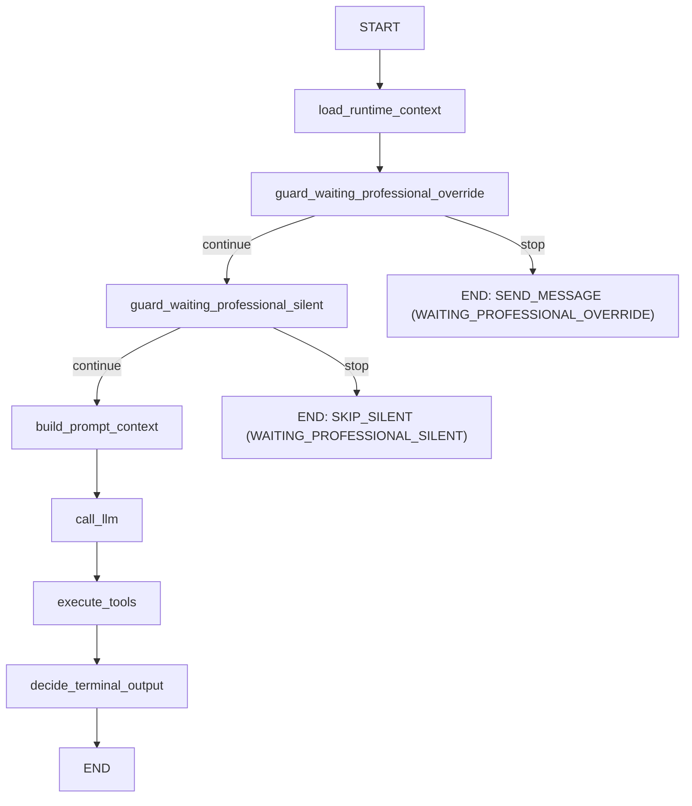
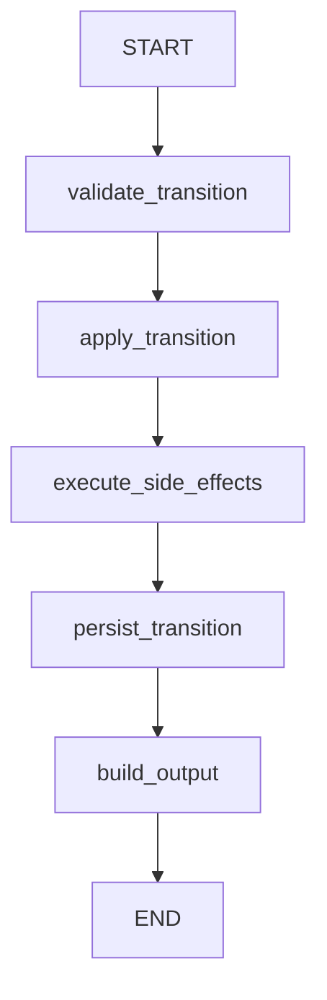

# Backend Context (MVP)

## Estado actual
- Backend MVP multi-tenant para atención por WhatsApp.
- Stack: FastAPI + arquitectura hexagonal + persistencia en Firestore.
- Orquestación agéntica: LangGraph en `src/services/agentic`.
- Providers activos:
  - WhatsApp: Meta Cloud API.
  - LLM: Gemini en Vertex AI (`GEMINI_*`).

## Reglas de Ingeniería Backend
Ver sección "Reglas de Ingeniería Backend" en `CLAUDE.md` (fuente canónica).

## Estructura de capas
- `src/entrypoints/web`: capa HTTP (routers, handlers, dependencias auth).
- `src/services`: casos de uso y DTOs principales.
- `src/services/agentic`: orquestación agéntica modular:
  - `graphs/`: grafos LangGraph (`ConversationGraph`, `SchedulingTransitionGraph`) — routing y tracing, sin lógica de negocio.
  - `tool_handlers/`: registry pattern — `ToolHandler` ABC + handlers por tool + `ToolHandlerRegistry` dispatcher.
  - `guards/`: guard chain — `ConversationGuard` ABC + 2 guards activos (`WaitingProfessionalOverrideGuard`, `WaitingProfessionalSilentGuard`) + helpers compartidos. Los guards `WaitingPatientChoiceGuard` y `NumericSlotSelectionGuard` ya no están en el grafo; su lógica la maneja el orquestador via `select_proposed_slot` y `reject_proposed_slots`.
  - `prompts/`: structured prompts — `PromptSection` ABC + 4 secciones + `PromptAssembler`.
  - `tool_calling_orchestrator.py`: loop LLM → tools → LLM (framework-agnostic, puro Python).
  - `runtime_context_resolver.py`: resuelve estado agéntico (request activa → `RuntimePromptContext`).
  - `conversation_message_sender.py`: envío WA + persistencia + archivado de subsessions.
  - `workflow_runtime_adapter.py`: adapter que implementa `ConversationWorkflowRuntimePort`, delega a los componentes anteriores.
  - `prompt_builder.py`: `RuntimePromptBuilder` — orquesta el build completo del prompt llamando todas las `PromptSection`.

  - `tool_registry.py`: `ToolDefinitionRegistry` — define schemas de tools para function calling del LLM (8 tools, incluyendo `select_proposed_slot` y `reject_proposed_slots`).
  - `workflow_engine.py`: `LangGraphAgentWorkflowEngine` — entry point que ejecuta `ConversationGraph` y `SchedulingTransitionGraph`.
  - `state_models.py`: modelos de estado — `RuntimePromptContext`, `ConversationGraphState`, `SchedulingTransitionGraphState`.
  - `tool_handlers/patient_profile_resolver.py`: helper que resuelve datos de perfil del paciente para `confirm_slot_handler`.
- `src/ports`: contratos/interfaces para adapters.
- `src/adapters/outbound`: implementaciones concretas (Meta, Gemini, seguridad, Firestore, in-memory para tests).
- `src/domain`: entidades/agregados Pydantic.
- `src/infra`: settings + wiring en `container.py`.

## Reglas de dependencia
- Flujo permitido: `entrypoints -> services -> ports <- adapters`.
- `infra/container` conecta puertos con adapters.
- `services` y `domain` no deben depender de adapters concretos.

## Funcionalidad implementada
Referencia completa de endpoints con schemas: ver `docs/API_ENDPOINTS.md`.

Dominios funcionales: Auth, Agent (prompt + settings), WhatsApp Onboarding, Google Calendar, Webhooks, Conversations (mensajes + control mode), Patients (CRUD), Blacklist, Manual Appointments, Scheduling Requests, Onboarding status, Dev tools.

Admin local (sin endpoint HTTP): `make create-professional`, `make delete-professional`.

## Lógica clave en webhook
- `webhook_service.py` (~733 líneas): orquestación HTTP — resolve tenant, dedup, upsert conversation, debounce, fallback.
- La lógica agéntica fue extraída a `src/services/agentic/` (ver estructura arriba).
- Flujo simplificado:
  1. Resuelve tenant por `phone_number_id`, deduplica por `provider_event_id`.
  2. Si blacklist → ignora. Si `OWNER_APP` echo → guarda `role=human_agent`, fuerza `HUMAN`.
  3. Si `CUSTOMER` en modo `AI` → ejecuta `ConversationGraph` (LangGraph):
     - Guards evalúan estado (patient choice, slot selection, professional wait, silent).
     - Si ningún guard intercepta → `ToolCallingOrchestrator` ejecuta loop LLM → tools → LLM.
     - `ConversationMessageSender` envía respuesta por WA y persiste.

## Persistencia actual
- Firestore como almacenamiento principal de estado de dominio.
- El estado del grafo se ejecuta en memoria por invocación; no reemplaza entidades de dominio.
- Refresh tokens persistidos y revocados en Firestore (rotación estricta).
- Endpoints dev (`/v1/dev/memory/reset` y `/v1/dev/memory/chat/reset`) limpian estado en Firestore.

## Flujo LangGraph (detallado)
- Cada mensaje inbound dispara una ejecución nueva del grafo desde `START`.
- En esta iteración no hay `checkpointer` ni `thread_id`; no se reanuda en nodo intermedio.
- La continuidad del proceso depende de estado persistido en Firestore (por ejemplo, `SchedulingRequest.status`, `Conversation.control_mode`).

### ConversationGraph (webhook AI path)

Nodos: 7. Cada guard delega a su clase en `guards/`. `call_llm` delega a `ToolCallingOrchestrator`. LangGraph solo rutea y traza. La selección/rechazo de slots propuestos la maneja el orquestador via tools `select_proposed_slot` y `reject_proposed_slots`.

### SchedulingTransitionGraph (transiciones de agenda)

Nodos: 5 (`validate_transition`, `apply_transition`, `execute_side_effects`, `persist_transition`, `build_output`).

## Invitaciones de Google Calendar al paciente
Al crear, reprogramar o cancelar un evento en Google Calendar:
- Se pasa el email del paciente en `attendees` y la query `sendUpdates=all`, de modo que **Google Calendar envía automáticamente la invitación/actualización/cancelación por correo al paciente desde la cuenta del profesional**.
- El scope OAuth actual (`https://www.googleapis.com/auth/calendar`) es suficiente — no se requiere `gmail.send` ni verificación de Google.
- Si la cita es virtual (`is_virtual=True` en manual, `appointment_modality=="VIRTUAL"` en chatbot), se añade `conferenceData.createRequest` con `conferenceSolutionKey.type=hangoutsMeet` y `conferenceDataVersion=1`; el `hangoutLink` se persiste como `meet_url` en la cita.
- El email del paciente se valida con `pydantic.EmailStr` en la entidad `Patient`. El chatbot además valida formato via regex en `PatientProfileResolver` antes de crear el paciente.
- Ver `src/adapters/outbound/google_calendar/google_calendar_provider_adapter.py` (`create_event`, `update_event`, `delete_event`).

## Logging y errores
- Logging estructurado JSON en `stdout`.
- Correlación por `X-Request-ID`:
  - si llega desde cliente/proxy, se reutiliza;
  - si no llega, se genera en middleware.
- Todas las respuestas HTTP incluyen header `X-Request-ID`.
- Errores no controlados en entrypoints:
  - response `500` con body `{"detail":"internal server error","request_id":"..."}`,
  - traceback completo solo en logs del servidor.
- Config por env:
  - `LOG_LEVEL` (default `INFO`)
  - `LOG_INCLUDE_REQUEST_SUMMARY` (default `false`)

## Comandos útiles
Ver sección "Comandos útiles" en `CLAUDE.md` (fuente canónica).

Comandos específicos de flujo OAuth local:
- `make create-professional` (solo primera vez)
- `make oauth-flow`
- `make memory-reset`
- `make chat-memory-reset`
